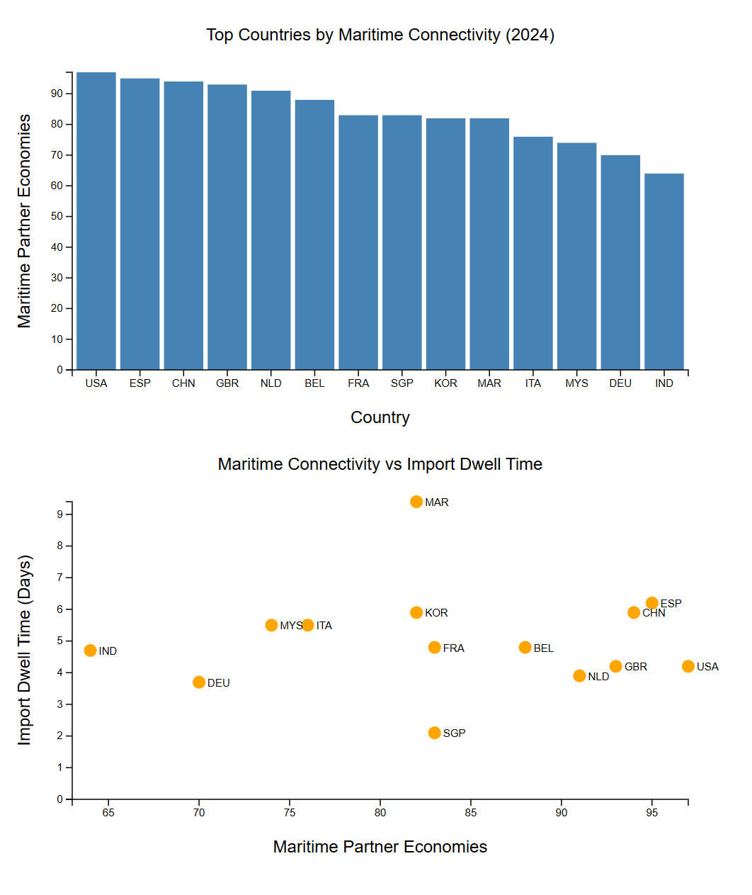

# 2024 Logistics Performance Indicators D3 Visualization

## Overview

This project visualizes selected indicators from the World Bank Logistics Performance Indicators (LPI) 2.0 dataset. The goal of the project is to demonstrate foundational D3.js skills by creating a bar chart and scatterplot using an external CSV file, scales, axes, and SVG elements.

The visualization focuses on maritime logistics performance. The bar chart compares countries by the number of maritime partner economies, which represents how connected each country is through direct liner shipping services. The scatterplot compares maritime connectivity with container import dwell time, which represents the average time imported containers spend at the port before leaving for the next stage of the supply chain.

## Key Questions

This visualization explores two basic logistics questions:

1. Which countries have the highest maritime connectivity?
2. How does maritime connectivity compare with import dwell time across countries?

## Key Takeaways

The bar chart shows that the United States has the highest maritime connectivity in the cleaned dataset, with 97 maritime partner economies. Spain, China, the United Kingdom, and the Netherlands also rank near the top, each with more than 90 or nearly 90 maritime partner economies. This suggests that these countries are strongly integrated into international container shipping networks.

The scatterplot shows that high maritime connectivity does not automatically mean low import dwell time. For example, the United States and the United Kingdom both have high maritime connectivity and relatively moderate import dwell times of 4.2 days. The Netherlands also performs well, with 91 maritime partners and a lower dwell time of 3.9 days.

Singapore stands out because it has strong maritime connectivity with 83 maritime partner economies and the lowest import dwell time in the cleaned dataset at 2.1 days. This combination suggests strong network access and efficient port movement.

Morocco stands out in the opposite direction. It has 82 maritime partner economies, which is similar to Singapore and South Korea, but its import dwell time is much higher at 9.4 days. This suggests that a country can be well connected through shipping networks while still facing delays after containers arrive.

For logistics policy, this comparison suggests that improving trade performance requires more than increasing shipping connections. Countries may also need to improve customs procedures, port operations, terminal capacity, cargo removal practices, and inland transportation systems.


## Dataset

**Source:**  
[World Bank Open Data - Logistic Performance Indicators (LPI) 2.0](https://data360.worldbank.org/en/dataset/WB_LPI_20)

**Dataset:**  
World Bank Logistics Performance Indicators (LPI) 2.0

The cleaned dataset used for this project includes three columns:

country_code  
maritime_partners  
import_dwell_time  

Each row represents one country or economy.

The variables used are:

1. `country_code`: country or economy code
2. `maritime_partners`: number of maritime partner economies connected through direct liner shipping services
3. `import_dwell_time`: average container import dwell time in days

The original dataset was processed in Excel before being used in D3. The cleaned CSV was created to keep the assignment simple and readable.

## Methods

The project follows a basic D3 workflow.

### Data Preparation

The original dataset was prepared in Excel before being used in D3. The raw dataset used a long format, where each row represented a country, year, indicator, and observed value. Because the `OBS_VALUE` column changes meaning depending on the selected `INDICATOR`, the data had to be filtered and reshaped into a simpler format for visualization.

The dataset was filtered to include only 2024 records. I then selected two maritime logistics indicators: maritime partner economies and container import dwell time. For the maritime connectivity indicator, `OBS_VALUE` was renamed as `maritime_partners`. For the import dwell time indicator, `OBS_VALUE` was renamed as `import_dwell_time`.

After filtering the two indicators separately, I combined them by country code so that each country had one row with both metrics. The final processed dataset includes 14 countries and three columns: `country_code`, `maritime_partners`, and `import_dwell_time`.

### D3 Visualization Process

The visualization was built in JavaScript using D3.js.

The code performs the following steps:

1. Create chart dimensions and margins.
2. Loads the cleaned CSV file using `d3.csv()`.
3. Converts numeric values from strings into numbers.
4. Creates a bar chart using `scaleBand()` and `scaleLinear()`.
5. Draws bars using SVG `rect` elements.
6. Adds x-axis and y-axis elements.
7. Adds a chart title and axis labels.
8. Creates a scatterplot using two linear scales.
9. Draws circles using SVG `circle` elements.
10. Adds country code labels next to scatterplot points.

## Visualization



### Bar Chart: Top Countries by Maritime Connectivity

The bar chart compares countries based on the number of maritime partner economies. Taller bars represent countries with more direct maritime connections.


### Scatterplot: Maritime Connectivity vs Import Dwell Time

The scatterplot compares maritime connectivity against import dwell time. Each circle represents one country. Country code labels are added next to the points to make the chart easier to interpret.

## Repository Structure

```text
Assignment_D3_HW1
│
├── data
│   ├── processed
│   └── raw
│
├── images
│   └── bar_chart_and_scatterplot.png
│
├── index.html
├── main.js
├── style.css
└── README.md
```

## Tools Used

D3.js  
JavaScript  
HTML  
CSS  
Excel  
GitHub  
Live Server  

## Limitations

This project is descriptive and uses a small cleaned version of the original LPI dataset. The visualization does not include all countries or all indicators from the full dataset.

The analysis should not be interpreted as a complete evaluation of national logistics performance. Maritime connectivity and import dwell time are useful indicators, but they do not explain all causes of performance differences. Factors such as port infrastructure, customs policy, labor capacity, inland transportation, geography, trade volume, and regional conflict may also affect logistics outcomes.

## Author

Siwon Lee  

BS in Data Visualization  

University of Washington Bothell