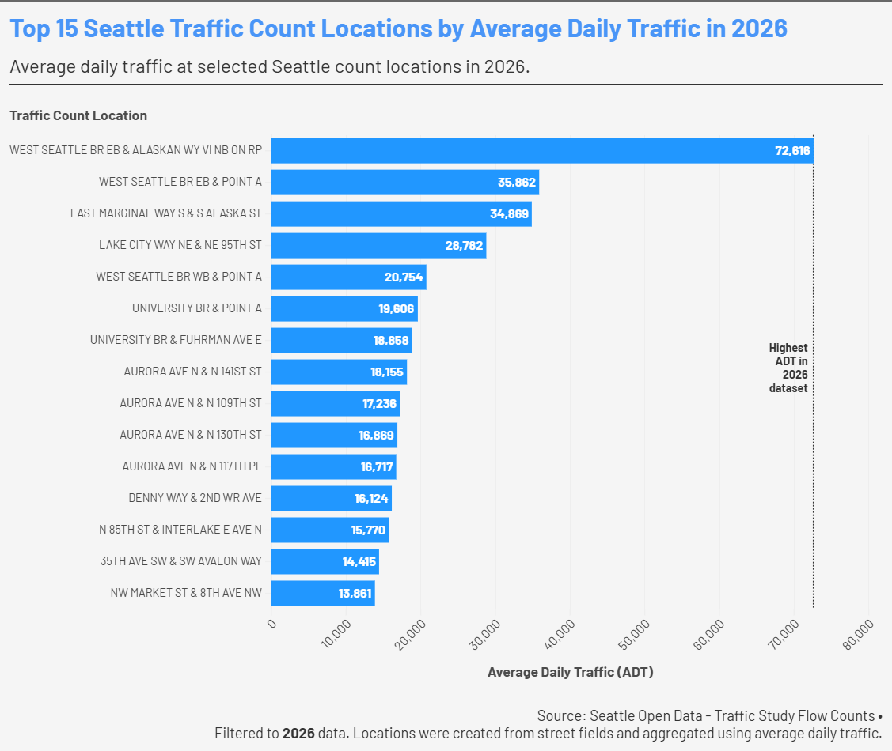

# Top Seattle Count Locations by Average Daily Traffic (2026)

## Overview
This visualization presents the top 15 traffic count locations in Seattle based on Average Daily Traffic (ADT) for the year 2026. ADT represents tbe average number of vehicles passing a given location per day and is commonly used as an indicator of traffic intensity

The chart highlights locations with the highest traffic volumes, which can be interpreted as high-pressure transportation corridors. In a logistics context, these areas may experience greater congestion and potential delivery dealys, making them important for understanding urban movement patterns.

The data was sourced from Seattle Open Data and processed in Python. The dataset was filtered to include only 2026 records, cleaned and standardize location fields, and aggregated by location to compute average traffic level. The 2026 data reflects records available at the time of analysis and does not represent a full calendar year.

---

## Flourish visualization

- Screenshot: 

- Interactive visualization link: [Flourish Public Project "Top 15 Seattle Traffic Count Locations by Average Daily Traffic in 2026"](https://public.flourish.studio/visualisation/28510547/)

---

## Data Source

- Dataset: Traffic Study Flow Counts
- Source: Seattle Open Data
- Link: [Seattle Open Data - Traffic Study Flow Counts](https://data.seattle.gov/dataset/Traffic-Study-Flow-Counts/mqiy-mya8/about_data)

---

## Methodology

- Filtered dataset to include only 2026 records ('STDY_YEAR == 2026')
- Selected relevant columns: location fields and traffic volume ('STUDY_ADT')
- Cleaned text fields to remove inconsistencies and whitespace
- Created a unified 'LOCATION' field from street names
- Aggregated data by location using the mean of ADT
- Sorted locations by traffic volume and selected the top 15

---

## Author

Siwon Lee

BS in Data Visualization

University of Washington Bothell