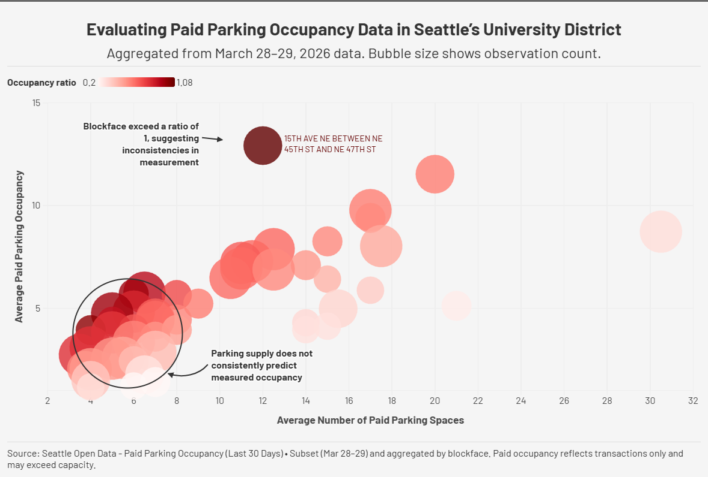

# Evaluating Paid Parking Occupancy Data in Seattle’s University District

## Overview
This visualization examines the relationship between parking supply and measured paid occupancy in Seattle’s University District. Each point represents a blockface, showing the average number of paid parking spaces and the average paid occupancy over a selected time period.

This visualization is used to evaluate the dataset itself. The results reveal that parking supply does not consistently predict measured occupancy, and that calculated occupancy can exceed expected capacity. These patterns highlight limitations in how the dataset represents parking demand.

The data was sourced from Seattle Open Data (Paid Parking Occupancy – Last 30 Days). A subset of records from March 28 to March 29, 2026 was used, then cleaned and aggregated in Python to compute average values by blockface.

---

## Flourish visualization

- Screenshot:  

- Interactive visualization link:  
[Flourish Public Project "Evaluating Paid Parking Occuapancy Data in Seattle's University District"](https://public.flourish.studio/story/3651914/)

---

## Data Source

- Dataset: Paid Parking Occupancy (Last 30 Days)  
- Source: Seattle Open Data  
- Link: [Seattle Open Data - Paid Parking Occupancy (Last 30 Days)](https://data.seattle.gov/Transportation/Paid-Parking-Occupancy-Last-30-Days-/rke9-rsvs/about_data)

---

## Methodology

- Filtered dataset to include records between March 28 and March 29, 2026  
- Selected relevant fields: blockface, occupancy, and parking space count  
- Cleaned and converted data types for analysis in Python (pandas)  
- Filtered data to the University District paid parking area  
- Aggregated minute-level records by blockface using mean values  
- Calculated occupancy ratio (paid occupancy / parking spaces)  
- Reduced dataset to top observations for visualization clarity  

---

## Notes

- The dataset measures **paid parking transactions**, not total parked vehicles  
- Calculated paid occupancy may exceed capacity due to unmetered vehicles, data gaps, or variations in recorded parking spaces.
- The dataset’s high temporal granularity requires aggregation before meaningful interpretation  
- The analysis is based on a subset of data and does not represent full system-wide parking conditions  

---

## Citations

City of Seattle. *On-Street Paid Parking Occupancy Data – Metadata.*  
Seattle Department of Transportation

---

## Author

Siwon Lee  

BS in Data Visualization  

University of Washington Bothell