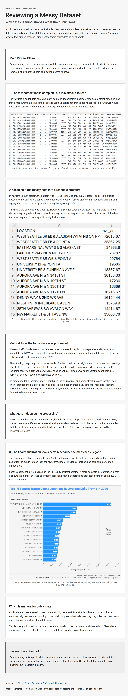

# Reviewing a Messy Dataset: Why Data Cleaning Shapes What the Public Sees

## Overview
This project is a public-facing webpage created with HTML and CSS. The page reviews the broader process of data cleaning, data processing, and data visualization, focusing on how these steps shape what the public eventually sees in a final chart or visual output.

The main idea is that a clean visualization does not come directly from raw data. Before a chart becomes readable, the data usually has to be filtered, cleaned, standardized, organized, and summarized. These steps are necessary, but they also affect what information becomes visible and what information becomes less visible.

The webpage uses screenshots from a previous Seattle traffic count project as an example. The traffic project is not the main focus of this assignment. It is used to show the movement from raw data, to processed data, to a final visualization.

## Webpage Output
Screenshot: 

The output screenshot shows the completed webpage as it appears in the browser, including the title, written review, section structure, images, captions, source link, and CSS styling.

## Data Source
Example dataset: Traffic Study Flow Counts  
Source: Seattle Open Data  
Link: [Seattle Open Data - Traffic Study Flow Counts](https://data.seattle.gov/dataset/Traffic-Study-Flow-Counts/mqiy-mya8/about_data)

The dataset screenshot is included as an example to support the webpage’s discussion of data cleaning and visualization.

## Images Used
Raw data screenshot: shows the original spreadsheet-style traffic count data before cleaning and processing  

Processed data screenshot: shows a simplified version of the data after selecting relevant fields, cleaning location information, and preparing the data for visualization  

Visualization screenshot: shows the final Flourish chart created from the processed traffic count data

All images are screenshots from Siwon Lee’s previous data processing and visualization work. They are used to illustrate how raw data can become a clean visual output after several processing steps.

## Methodology
The webpage was built by fully revising the provided `index.html` and `style.css` files. In `index.html`, the original placeholder content was replaced with a public-facing review about data cleaning and visualization. The page was organized into sections with a title, subtitle, opening explanation, main claim, image-based examples, method explanation, critical reflection, final review score, and source information.

The HTML uses headings, paragraphs, sections, figures, captions, a hyperlink, images, alt text, and an HTML comment. The images are placed in workflow order: raw data first, processed data second, and final visualization third. This structure helps show how data changes before it becomes a public-facing chart.

In `style.css`, the original styling was changed to improve readability and organization while keeping the design simple. The font type was changed using a Google Font, and font size, text color, spacing, margins, and borders were adjusted. CSS class selectors were used to style specific parts of the page, including the main claim, method section, critical reflection, and rating section. Images were centered and resized with CSS, and a CSS comment was included to document the styling.

The final page was tested using Live Server to make sure the layout, fonts, images, links, and styling appeared correctly in the browser.

## Purpose
The purpose of this assignment is to demonstrate basic comprehension of HTML and CSS while connecting the practice webpage to a critical topic in data visualization. The page shows that data cleaning is not just about the technical tasks, but also part of how information is prepared for public understanding.

By comparing raw data, processed data, and a final visualization, the webpage explains that data has to be selected, cleaned, structured, and presented before it becomes meaningful to an audience.

## Files Included
`index.html`: main webpage structure and written content  
`style.css`: visual styling for layout, fonts, spacing, sections, images, and links  
Raw data image: screenshot of the original dataset example  
Processed data image: screenshot of the cleaned dataset example  
Visualization image: screenshot of the final visualization example  
Output screenshot: screenshot of the rendered webpage served through Live Server  

## Author
Siwon Lee  

BS in Data Visualization  

University of Washington Bothell